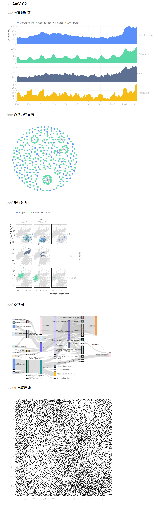

# Liquid Formatter
## 说明
Liquid Formatter是为Halo 2.0开发的一款多模态内容转换插件，可以内嵌多种形式的信息。在插件使用过程中如果遇到问题或错误欢迎各位用户在本开源仓库中提供issues。目前插件囊括的功能如下：
- AntV G2（整合中）
- AntV X6（计划整合中）
- 其他待定...

## 效果


## 使用文档
为了确保能使用以下的功能，使用者需要在插件设置页面启用相应的功能。
[演示页面](https://dioxide-cn.ink/archives/liquid-formatter-antv)

### AntV G2
参考[阿里巴巴官方AntV G2文档](https://g2.antv.antgroup.com/examples#geo-geo)，在文章中按如下的格式进行编写：

```html
<div id="chart_1"></div>

<!-- 这里使用markdown语法插入g2的代码 -->
```

在插入G2JS代码的位置你必须使用markdown的代码块并将其标注为g2语言（\`\`\`g2 \`\`\`）随后将方法插入其中（这里以分面帧动画为例）：

```g2
fetch('https://gw.alipayobjects.com/os/bmw-prod/7fbb7084-cf34-4e7c-91b3-09e4748dc5e9.json')
  .then((res) => res.json())
  .then((data) => {
    const chart_1 = new G2.Chart({
      container: 'chart_4',
      theme: 'classic',
      width: ${(<800:occupied)(800)},
    });
    const padding = (node) =>
      node.attr('paddingRight', 86).attr('paddingLeft', 54);
    const encode = (node) =>
      node
        .encode('shape', 'smooth')
        .encode('x', (d) => new Date(d.date))
        .encode('y', 'unemployed')
        .encode('color', 'industry')
        .encode('key', 'industry');
    const utcX = (node) => node.scale('x', { utc: true });
    const keyframe = chart_1
      .timingKeyframe()
      .attr('direction', 'alternate')
      .attr('iterationCount', 2);
    keyframe
      .facetRect()
      .call(padding)
      .data(data)
      .encode('y', 'industry')
      .area()
      .attr('class', 'area')
      .attr('frame', false)
      .call(encode)
      .call(utcX)
      .scale('y', { facet: false })
      .style('fillOpacity', 1)
      .animate('enter', { type: 'scaleInY' });
    keyframe
      .area()
      .call(padding)
      .data(data)
      .attr('class', 'area')
      .transform({ type: 'stackY', reverse: true })
      .call(encode)
      .call(utcX)
      .style('fillOpacity', 1);
    keyframe
      .area()
      .call(padding)
      .data(data)
      .attr('class', 'area')
      .call(encode)
      .call(utcX)
      .style('fillOpacity', 0.8);
    chart_1.render();
  });
```

### Liquid表达式
无论是G2还是X6它们在创建时就被固定了大小，虽然你可以通过设置`autoFit:true`来实现自适应容器大小，但是这显然还是无法满足部分用户的需求。所以用户可以在本插件中使用**Liquid表达式**来动态初始化容器大小（但这不是跟随页面尺寸而自动调整大小）一个合法的Liquid表达式应该形式如下：
1. `${(<800:occupied)(800)}`：当屏幕尺寸**小于**800像素时直接使用父容器的宽度，否则固定为800像素
2. `${(<=500:occupied)(410)}`：当屏幕尺寸**小于等于**500像素时直接使用父容器的宽度，否则固定为410像素
3. `${occupied}`：直接使用父容器的宽度
4. 如果使用括号条件则必须按照1和2中的顺序写入

尽管Liquid表达式目前仍有一定的局限性和正在测试性，但已经能满足绝大部分用户的需求。
